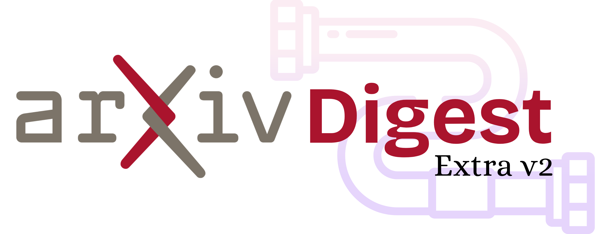
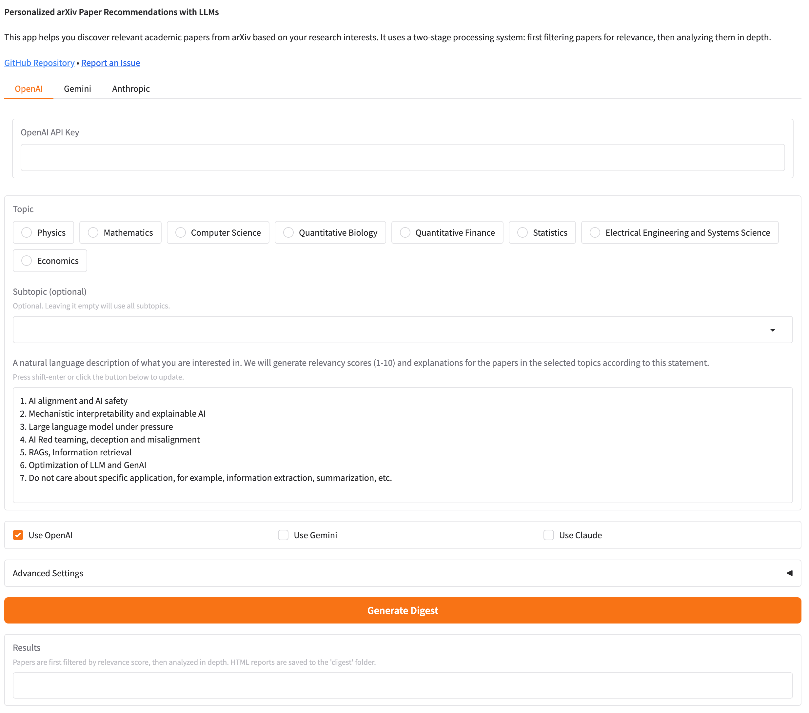

<p align="center"></p>

# ArXiv Digest (Enhanced Edition)

**Personalized arXiv Paper Recommendations with Multiple AI Models**

This repository provides an enhanced daily digest for newly published arXiv papers based on your research interests, leveraging multiple AI models including OpenAI GPT, Google Gemini, and Anthropic Claude to provide relevancy ratings, detailed analysis, and topic clustering.

## 📚 Contents

- [Features](#-features)
- [Quick Start](#-quick-start)
- [What This Repo Does](#-what-this-repo-does)
- [Model Integrations](#-model-integrations)
- [Design Paper Discovery](#-design-paper-discovery)
- [Output Formats](#-output-formats)
- [Setting Up and Usage](#-setting-up-and-usage)
  * [Configuration](#configuration)
  * [Running the Web Interface](#running-the-web-interface)
  * [Running via GitHub Action](#running-via-github-action)
  * [Running from Command Line](#running-from-command-line)
- [API Usage Notes](#-api-usage-notes)
- [Directory Structure](#-directory-structure)
- [Roadmap](#-roadmap)
- [Contributing](#-contributing)

## ✨ Features

- **Multi-Model Integration**: Support for OpenAI, Gemini, and Claude models for paper analysis
- **Latest Models**: Support for GPT-4o, GPT-4o mini, Claude 3.5, and other current models
- **Two-Stage Processing**: Efficient paper analysis with quick filtering followed by detailed analysis
- **Enhanced Analysis**: Detailed paper breakdowns including key innovations, critical analysis, and practical applications
- **HTML Report Generation**: Clean, organized reports saved with date-based filenames
- **Adjustable Relevancy Threshold**: Interactive slider for filtering papers by relevance score
- **Design Automation Backend**: Specialized tools for analyzing design-related papers
- **Topic Clustering**: Group similar papers using AI-powered clustering (Gemini)
- **Robust JSON Parsing**: Reliable extraction of analysis results from LLM responses
- **Standardized Directory Structure**: Organized codebase with `/src`, `/data`, and `/digest` directories
- **Improved Web UI**: Clean Gradio interface with dynamic topic selection and error handling



## 🚀 Quick Start

Try it out on [Hugging Face](https://huggingface.co/spaces/linhkid91/ArxivDigest-extra) using your own API keys.

## 🔍 What This Repo Does

Staying up to date on [arXiv](https://arxiv.org) papers is time-consuming, with hundreds of new papers published daily. Even with the [official daily digest service](https://info.arxiv.org/help/subscribe.html), categories like [cs.AI](https://arxiv.org/list/cs.AI/recent) still contain 50-100 papers per day.

This repository creates a personalized daily digest by:

1. **Crawling arXiv** for recent papers in your areas of interest
2. **Analyzing papers** in-depth using AI models (OpenAI, Gemini, or Claude)
3. **Two-stage processing** for efficiency:
   - Stage 1: Quick relevancy filtering using only title and abstract
   - Stage 2: Detailed analysis of papers that meet the relevancy threshold
4. **Scoring relevance** on a scale of 1-10 based on your research interests
5. **Providing detailed analysis** of each paper, including:
   - Key innovations
   - Critical analysis
   - Implementation details
   - Practical applications
   - Related work
6. **Generating reports** in HTML format with clean organization

## 🤖 Model Integrations

The system supports three major AI providers:

- **OpenAI GPT** (gpt-3.5-turbo-16k, gpt-4, gpt-4-turbo, gpt-4o, gpt-4o-mini)
- **Google Gemini** (gemini-1.5-flash, gemini-1.5-pro, gemini-2.0-flash)
- **Anthropic Claude** (claude-3-haiku, claude-3-sonnet, claude-3-opus, claude-3.5-sonnet)

You can use any combination of these models, allowing you to compare results or choose based on your needs.

## 📊 Output Formats

Reports are generated in multiple formats:

- **HTML Reports**: Clean, organized reports saved to the `/digest` directory with date-based filenames
- **Console Output**: Summary information displayed in the terminal
- **JSON Data**: Raw paper data saved to the `/data` directory

Every HTML report includes:
- Paper title, authors, and link to arXiv
- Relevancy score with explanation
- Abstract and key innovations
- Critical analysis and implementation details
- Experiments, results, and discussion points
- Related work and practical applications

Example HTML report:


## 💡 Setting Up and Usage

### Configuration

Modify `config.yaml` with your preferences:

```yaml
# Main research area
topic: "Computer Science"

# Specific categories to monitor
categories: ["Artificial Intelligence", "Computation and Language", "Machine Learning", "Information Retrieval"]

# Minimum relevance score (1-10)
threshold: 2

# Your research interests in natural language
interest: |
  1. AI alignment and AI safety
  2. Mechanistic interpretability and explainable AI
  3. Large language model optimization
  4. RAGs, Information retrieval
  5. AI Red teaming, deception and misalignment
```

### Running the Web Interface

To run locally with the simplified UI:

1. Install requirements: `pip install -r requirements.txt`
2. Run the app: `python src/app_new.py` 
3. Open the URL displayed in your terminal
4. Enter your API key(s) and configure your preferences
5. Use the relevancy threshold slider to adjust paper filtering (default is 2)

### Running via GitHub Action

To set up automated daily digests:

1. Fork this repository
2. Update `config.yaml` with your preferences
3. Set the following secrets in your repository settings:
   - `OPENAI_API_KEY` (and/or `GEMINI_API_KEY` or `ANTHROPIC_API_KEY`)
4. The GitHub Action will run on schedule or can be triggered manually

### Running from Command Line

For advanced users:

```bash
# Regular paper digests with simplified UI
python src/app_new.py

# Design paper finder
./src/design/find_design_papers.sh --days 7 --analyze
```

## ⚠️ API Usage Notes

This tool respects arXiv's robots.txt and implements proper rate limiting. If you encounter 403 Forbidden errors:

1. Wait a few hours before trying again
2. Consider reducing the number of categories you're fetching
3. Increase the delay between requests in the code

## 📁 Directory Structure

The repository is organized as follows:

- `/src` - All Python source code
  - `app_new.py` - Simplified interface with improved threshold handling and UI
  - `download_new_papers.py` - arXiv crawler
  - `relevancy.py` - Paper scoring and analysis with robust JSON parsing
  - `model_manager.py` - Multi-model integration
  - `gemini_utils.py` - Gemini API integration
  - `anthropic_utils.py` - Claude API integration
  - `design/` - Design automation tools
  - `paths.py` - Standardized path handling
- `/data` - JSON data files (auto-created)
- `/digest` - HTML report files (auto-created)

## ✅ Roadmap

- [x] Support multiple AI models (OpenAI, Gemini, Claude)
- [x] Generate comprehensive HTML reports with date-based filenames
- [x] Specialized analysis for design automation papers
- [x] Topic clustering via Gemini
- [x] Standardized directory structure
- [x] Enhanced HTML reports with detailed analysis sections
- [x] Pre-filtering of arXiv categories for efficiency
- [x] Adjustable relevancy threshold with UI slider
- [x] Robust JSON parsing for reliable LLM response handling
- [x] Simplified UI focused on core functionality
- [x] Dynamic topic selection UI with improved error handling
- [x] Support for newer models (GPT-4o, GPT-4o mini, Claude 3.5)
- [x] Two-stage paper processing for efficiency (quick filtering followed by detailed analysis)
- [x] Removed email functionality in favor of local HTML reports
- [ ] Full PDF content analysis
- [ ] Author-based ranking and filtering
- [ ] Fine-tuned open-source model support: Ollama, LocalAI...

## 💁 Contributing

You're encouraged to modify this code for your personal needs. If your modifications would be useful to others, please submit a pull request.

Valuable contributions include:
- Additional AI model integrations
- New analysis capabilities
- UI improvements
- Prompt engineering enhancements
