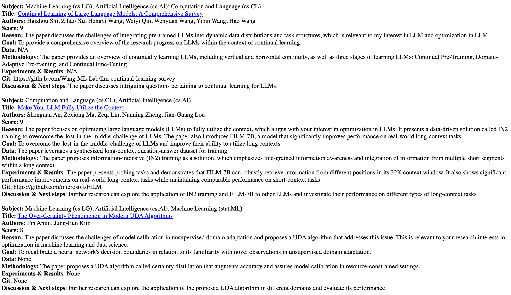

<p align="center"></p>

# ArXiv Digest (Enhanced Edition)

**Personalized arXiv Paper Recommendations with Multiple AI Models**

This repository provides an enhanced daily digest for newly published arXiv papers based on your research interests, leveraging multiple AI models including OpenAI GPT, Google Gemini, and Anthropic Claude to provide relevancy ratings, detailed analysis, and topic clustering.

## 📚 Contents

- [Features](#-features)
- [Quick Start](#-quick-start)
- [What This Repo Does](#-what-this-repo-does)
- [Model Integrations](#-model-integrations)
- [Design Paper Discovery](#-design-paper-discovery)
- [Output Formats](#-output-formats)
- [Setting Up and Usage](#-setting-up-and-usage)
  * [Configuration](#configuration)
  * [Running the Web Interface](#running-the-web-interface)
  * [Running via GitHub Action](#running-via-github-action)
  * [Running from Command Line](#running-from-command-line)
- [API Usage Notes](#-api-usage-notes)
- [Directory Structure](#-directory-structure)
- [Roadmap](#-roadmap)
- [Contributing](#-contributing)

## ✨ Features

- **Multi-Model Integration**: Support for OpenAI, Gemini, and Claude models for paper analysis
- **Enhanced Analysis**: Detailed paper breakdowns including key innovations, critical analysis, and practical applications
- **HTML Report Generation**: Clean, organized reports saved with date-based filenames
- **Design Automation Focus**: Specialized tools for finding and analyzing design-related papers
- **Mechanistic Interpretability**: Special analysis for papers focused on AI safety and mechanistic interpretability
- **Email Integration**: Send digests via email using SendGrid
- **Topic Clustering**: Group similar papers using AI-powered clustering (Gemini)
- **Standardized Directory Structure**: Organized codebase with `/src`, `/data`, and `/digest` directories
- **Web UI**: Easy-to-use Gradio interface for interactive use

## 🚀 Quick Start

Try it out on [Hugging Face](https://huggingface.co/spaces/linhkid91/ArxivDigest-extra) using your own API keys.

## 🔍 What This Repo Does

Staying up to date on [arXiv](https://arxiv.org) papers is time-consuming, with hundreds of new papers published daily. Even with the [official daily digest service](https://info.arxiv.org/help/subscribe.html), categories like [cs.AI](https://arxiv.org/list/cs.AI/recent) still contain 50-100 papers per day.

This repository creates a personalized daily digest by:

1. **Crawling arXiv** for recent papers in your areas of interest
2. **Analyzing papers** in-depth using AI models (OpenAI, Gemini, or Claude)
3. **Scoring relevance** on a scale of 1-10 based on your research interests
4. **Providing detailed analysis** of each paper, including:
   - Key innovations
   - Critical analysis
   - Implementation details
   - Practical applications
   - Related work
5. **Generating reports** in HTML format with clean organization
6. Optionally **sending email digests** using SendGrid

## 🤖 Model Integrations

The system supports three major AI providers:

- **OpenAI GPT** (gpt-3.5-turbo-16k, gpt-4, gpt-4-turbo)
- **Google Gemini** (gemini-1.5-flash, gemini-1.5-pro, gemini-2.0-flash)
- **Anthropic Claude** (claude-3-haiku, claude-3-sonnet, claude-3-opus)

You can use any combination of these models, allowing you to compare results or choose based on your needs.

## 🎨 Design Paper Discovery

A specialized module is included for finding papers related to AI/ML for design automation:

- **Design Automation Tool**: Find papers related to design automation, creative AI, and generative design
- **Categorization**: Automatically sort papers into categories like UI/UX Design, Layout Generation, etc.
- **Technique Analysis**: Identify papers using specific techniques like GANs, Diffusion Models, LLMs, etc.

Run this as a standalone tool with:

```bash
# Basic usage
./find_design_papers.sh

# With keyword filtering
./find_design_papers.sh --keyword "layout"

# With LLM analysis for comprehensive paper details
./find_design_papers.sh --analyze

# Customize your research interests for analysis
./find_design_papers.sh --analyze --interest "I'm looking for papers on UI/UX automation and layout generation with neural networks"

# Advanced usage with all options
./find_design_papers.sh --days 14 --keyword "diffusion" --analyze --model "gpt-4-turbo"

# Output files include the current date by default:
# - data/design_papers_diffusion_20250406.json
# - digest/design_papers_diffusion_20250406.html

# Disable date in filenames if needed
./find_design_papers.sh --keyword "layout" --no-date
```

## 📊 Output Formats

Reports are generated in multiple formats:

- **HTML Reports**: Clean, organized reports saved to the `/digest` directory with date-based filenames
- **Console Output**: Summary information displayed in the terminal
- **Email**: Optional email delivery via SendGrid
- **JSON Data**: Raw paper data saved to the `/data` directory

Every HTML report includes:
- Paper title, authors, and link to arXiv
- Relevancy score with explanation
- Abstract and key innovations
- Critical analysis and implementation details
- Experiments, results, and discussion points
- Related work and practical applications

Example HTML report:

<p align="left"></p>

## 💡 Setting Up and Usage

### Configuration

Modify `config.yaml` with your preferences:

```yaml
# Main research area
topic: "Computer Science"

# Specific categories to monitor
categories: ["Artificial Intelligence", "Computation and Language", "Machine Learning", "Information Retrieval"]

# Minimum relevance score (1-10)
threshold: 2

# Your research interests in natural language
interest: |
  1. AI alignment and AI safety
  2. Mechanistic interpretability and explainable AI
  3. Large language model optimization
  4. RAGs, Information retrieval
  5. AI Red teaming, deception and misalignment
```

### Running the Web Interface

To run locally with the full UI:

1. Install requirements: `pip install -r requirements.txt`
2. Run the app: `python src/app.py` 
3. Open the URL displayed in your terminal
4. Enter your API key(s) and configure your preferences

### Running via GitHub Action

To set up automated daily digests:

1. Fork this repository
2. Update `config.yaml` with your preferences
3. Set the following secrets in your repository settings:
   - `OPENAI_API_KEY` (and/or `GEMINI_API_KEY` or `ANTHROPIC_API_KEY`)
   - `SENDGRID_API_KEY` (for email delivery)
   - `FROM_EMAIL` (must match the email used for your SendGrid key)
   - `TO_EMAIL` (recipient email)
4. The GitHub Action will run on schedule or can be triggered manually

### Running from Command Line

For advanced users:

```bash
# Regular paper digests
python src/app.py

# Design paper finder
python -m src.design.find_design_papers --days 7 --analyze
```

## ⚠️ API Usage Notes

This tool respects arXiv's robots.txt and implements proper rate limiting. If you encounter 403 Forbidden errors:

1. Wait a few hours before trying again
2. Consider reducing the number of categories you're fetching
3. Increase the delay between requests in the code

## 📁 Directory Structure

The repository is organized as follows:

- `/src` - All Python source code
  - `app.py` - Main web interface
  - `app_new.py` - Updated interface with multi-model support
  - `download_new_papers.py` - arXiv crawler
  - `relevancy.py` - Paper scoring and analysis
  - `model_manager.py` - Multi-model integration
  - `gemini_utils.py` - Gemini API integration
  - `design/` - Design automation tools
  - `paths.py` - Standardized path handling
- `/data` - JSON data files (auto-created)
- `/digest` - HTML report files (auto-created)

## ✅ Roadmap

- [x] Support multiple AI models (OpenAI, Gemini, Claude)
- [x] Generate comprehensive HTML reports with date-based filenames
- [x] Specialized analysis for design automation papers
- [x] Mechanistic interpretability analysis
- [x] Topic clustering via Gemini
- [x] Standardized directory structure
- [x] Enhanced HTML reports with detailed analysis sections
- [x] Pre-filtering of arXiv categories for efficiency
- [ ] Full PDF content analysis
- [ ] Author-based ranking and filtering
- [ ] Fine-tuned open-source model support

## 💁 Contributing

You're encouraged to modify this code for your personal needs. If your modifications would be useful to others, please submit a pull request.

Valuable contributions include:
- Additional AI model integrations
- New analysis capabilities
- UI improvements
- Prompt engineering enhancements